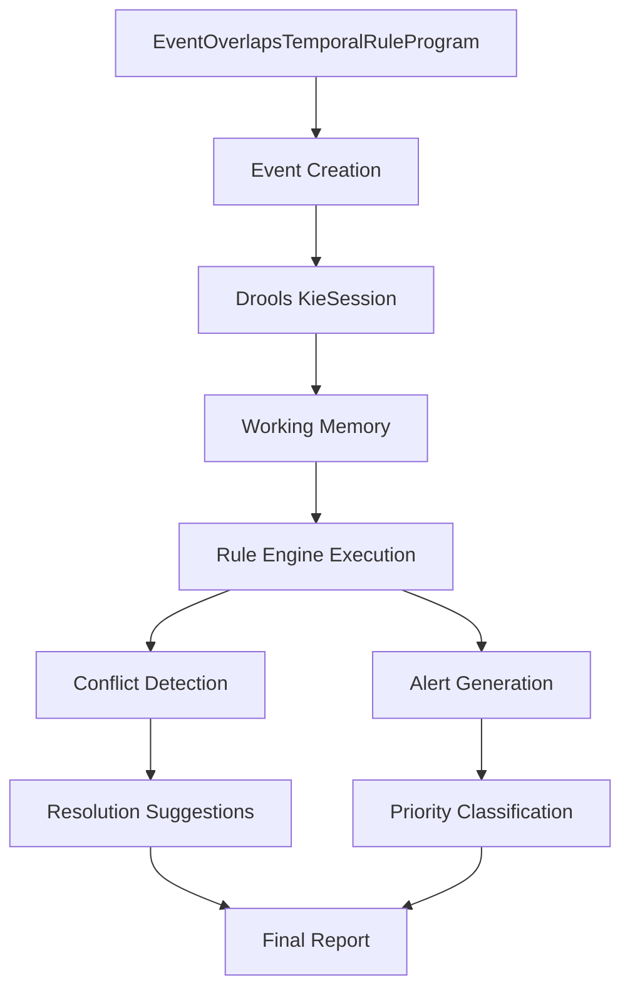

# EventOverlapsTemporalRuleProgram Documentation

## 📋 Table of Contents
- [Overview](#overview)
- [Architecture](#architecture)
- [Project Structure](#project-structure)
- [Event Model Hierarchy](#event-model-hierarchy)
- [Temporal Rules Engine](#temporal-rules-engine)
- [Setup Instructions](#setup-instructions)
- [Rule Explanations](#rule-explanations)
- [Execution Flow](#execution-flow)
- [Sample Output](#sample-output)
- [Troubleshooting](#troubleshooting)
- [Extensions](#extensions)

## 🎯 Overview

The **EventOverlapsTemporalRuleProgram** is a sophisticated Complex Event Processing (CEP) system built with Java and Drools. It demonstrates advanced temporal reasoning by detecting conflicts, overlaps, and patterns across different types of scheduled events in an enterprise environment.

### Key Features
- ✅ **Temporal Overlap Detection** - Identifies time-based conflicts between events
- ✅ **Priority-Based Conflict Resolution** - Handles conflicts based on event importance
- ✅ **Resource Management** - Tracks room bookings, equipment usage, and capacity
- ✅ **Emergency Handling** - Prioritizes critical maintenance and emergency events
- ✅ **Real-time Processing** - Uses Drools rule engine for immediate conflict detection
- ✅ **Comprehensive Reporting** - Generates detailed analysis with resolution suggestions

## 🏗️ Architecture



### Core Components
1. **Event Model** - Hierarchical event structure with temporal properties
2. **Rule Engine** - Drools-based temporal reasoning system
3. **Conflict Detection** - Pattern matching for overlapping events
4. **Alert System** - Priority-based notification framework
5. **Analysis Engine** - Statistical reporting and recommendations

## 📁 Project Structure

```
src/main/
├── java/com/kaleshrikant/drools/cep/
│   ├── EventOverlapsTemporalRuleProgram.java    # Main application
│   └── model/
│       ├── Event.java                           # Base event class
│       ├── Meeting.java                         # Meeting events
│       ├── ResourceBooking.java                 # Resource reservations
│       ├── MaintenanceEvent.java               # Maintenance activities
│       ├── EventConflict.java                  # Conflict representation
│       └── EventAlert.java                     # Alert notifications
└── resources/
    ├── META-INF/
    │   └── kmodule.xml                          # Drools configuration
    └── rules/
        └── EventOverlapsTemporalRule.drl        # Business rules
```

## 🎭 Event Model Hierarchy

### 1. Base Event Class
```java
public class Event {
    protected String id;              // Unique identifier
    protected String name;            // Event name
    protected LocalDateTime startTime; // Event start time
    protected LocalDateTime endTime;  // Event end time
    protected String location;        // Physical/virtual location
    protected int priority;           // Event priority (0-10)
    protected String status;          // ACTIVE, CANCELLED, COMPLETED

    // Temporal methods
    public boolean overlaps(Event other);
    public long getOverlapDuration(Event other);
    public long getDurationMinutes();
}
```

### 2. Meeting Events
- **Purpose**: Business meetings, conferences, calls
- **Special Properties**:
  - Attendee list management
  - Virtual/physical meeting support
  - Meeting type classification
- **Example**: Board meetings, team standups, client presentations

### 3. Resource Booking Events
- **Purpose**: Room reservations, equipment bookings
- **Special Properties**:
  - Resource type and ID tracking
  - Exclusive access control
  - Booking owner identification
- **Example**: Conference room bookings, projector reservations

### 4. Maintenance Events
- **Purpose**: System maintenance, facility upkeep
- **Special Properties**:
  - Emergency flag for critical maintenance
  - Affected systems tracking
  - Technician assignment
- **Example**: Server maintenance, HVAC repairs, emergency fixes

## ⚙️ Temporal Rules Engine

The system implements **8 sophisticated temporal rules** using Drools:

### Rule 1: Room Booking Conflicts
```drl
rule "Room Booking Conflict"
    when
        $booking1: ResourceBooking(resourceType == "ROOM", status == "ACTIVE", $room: resourceId)
        $booking2: ResourceBooking(resourceType == "ROOM", resourceId == $room,
                                  status == "ACTIVE", this != $booking1,
                                  this.overlaps($booking1))
    then
        // Create high-severity conflict (8/10)
        // Suggest rescheduling resolution
end
```

**Detects**: Double-booking of conference rooms
**Severity**: 8/10 (High)
**Resolution**: Reschedule one of the conflicting bookings

### Rule 2: High-Priority Meeting Overlaps
```drl
rule "High Priority Meeting Overlap"
    when
        $meeting1: Meeting(priority >= 8, status == "ACTIVE")
        $meeting2: Meeting(priority >= 8, status == "ACTIVE", this != $meeting1,
                          this.overlaps($meeting1))
    then
        // Create critical conflict (9/10)
        // Generate priority alert
end
```

**Detects**: Overlapping high-importance meetings (priority ≥ 8)
**Severity**: 9/10 (Critical)
**Action**: Creates both conflict record and high-priority alert

### Rule 3: Maintenance During Business Hours
```drl
rule "Maintenance During Business Hours"
    when
        $maintenance: MaintenanceEvent(emergency == false, status == "ACTIVE",
                                     startTime.getHour() >= 9, startTime.getHour() <= 17)
        $meeting: Meeting(status == "ACTIVE", this.overlaps($maintenance))
    then
        // Create moderate conflict (6/10)
        // Suggest maintenance rescheduling
end
```

**Detects**: Non-emergency maintenance conflicting with meetings during 9 AM - 5 PM
**Severity**: 6/10 (Medium)
**Resolution**: Reschedule maintenance to off-hours

### Rule 4: Virtual Meeting Capacity
```drl
rule "Virtual Meeting Capacity Warning"
    when
        $meeting: Meeting(virtual == true, attendeeCount > 50, status == "ACTIVE")
    then
        // Generate capacity warning alert
end
```

**Detects**: Large virtual meetings (>50 attendees)
**Purpose**: Infrastructure planning and resource allocation
**Priority**: 5/10 (Medium)

### Rule 5: Emergency Maintenance Priority
```drl
rule "Emergency Maintenance Priority"
    when
        $emergency: MaintenanceEvent(emergency == true, status == "ACTIVE")
        $event: Event(status == "ACTIVE", this != $emergency, this.overlaps($emergency))
    then
        // Create maximum severity conflict (10/10)
        // Suggest suspending other events
end
```

**Detects**: Emergency maintenance conflicting with any other event
**Severity**: 10/10 (Maximum)
**Resolution**: Suspend or relocate conflicting events

### Rule 6: Long Meeting Duration
```drl
rule "Long Meeting Duration Warning"
    when
        $meeting: Meeting(this.getDurationMinutes() > 180, status == "ACTIVE")
    then
        // Generate duration warning
end
```

**Detects**: Meetings longer than 3 hours
**Purpose**: Meeting efficiency and resource optimization
**Priority**: 3/10 (Low)

### Rule 7: Resource High Utilization
```drl
rule "Resource High Utilization"
    when
        $resource: ResourceBooking($resId: resourceId, $resType: resourceType, status == "ACTIVE")
        $count: Number(intValue >= 3) from accumulate(
            ResourceBooking(resourceId == $resId, resourceType == $resType, status == "ACTIVE"),
            count(1)
        )
    then
        // Generate utilization alert
end
```

**Detects**: Resources with 3+ concurrent bookings
**Purpose**: Capacity planning and resource procurement
**Priority**: 4/10 (Medium-Low)

### Rule 8: Exclusive Location Conflicts
```drl
rule "Exclusive Location Conflict"
    when
        $booking1: ResourceBooking(exclusive == true, $loc: location, location != null, status == "ACTIVE")
        $event: Event(location == $loc, status == "ACTIVE", this != $booking1,
                     this.overlaps($booking1))
    then
        // Create location conflict (7/10)
        // Suggest event relocation
end
```

**Detects**: Events in locations marked for exclusive use
**Severity**: 7/10 (High-Medium)
**Resolution**: Relocate conflicting events

## 🚀 Setup Instructions

### Prerequisites
- Java 11 or higher
- Maven 3.6+ or Gradle 6+
- IDE (IntelliJ IDEA, Eclipse, VS Code)

### Dependencies (Maven)
```xml
<dependencies>
    <dependency>
        <groupId>org.drools</groupId>
        <artifactId>drools-core</artifactId>
        <version>8.44.0.Final</version>
    </dependency>
    <dependency>
        <groupId>org.drools</groupId>
        <artifactId>drools-compiler</artifactId>
        <version>8.44.0.Final</version>
    </dependency>
    <dependency>
        <groupId>org.kie</groupId>
        <artifactId>kie-api</artifactId>
        <version>8.44.0.Final</version>
    </dependency>
</dependencies>
```

### Configuration Files

#### kmodule.xml
```xml
<?xml version="1.0" encoding="UTF-8"?>
<kmodule xmlns="http://www.drools.org/xsd/kmodule">
    <kbase name="event-temporal-kbase" packages="rules">
        <ksession name="event-temporal-ksession"/>
    </kbase>
</kmodule>
```

#### File Locations
- `src/main/resources/META-INF/kmodule.xml`
- `src/main/resources/rules/EventOverlapsTemporalRule.drl`

## 🔄 Execution Flow

### Phase 1: Initialization
1. **Load Drools Configuration** - Parse kmodule.xml
2. **Create KieSession** - Initialize rule engine session
3. **Setup Global Variables** - Create conflicts and alerts collections

### Phase 2: Event Creation
```java
private List<Event> createComplexEventScenario() {
    // Create realistic business scenario with:
    // - Overlapping room bookings
    // - High-priority meeting conflicts
    // - Emergency maintenance events
    // - Large virtual meetings
    // - Resource utilization scenarios
}
```

### Phase 3: Rule Processing
1. **Insert Events** - Add all events to working memory
2. **Fire Rules** - Execute temporal reasoning rules
3. **Collect Results** - Gather conflicts and alerts

### Phase 4: Analysis & Reporting
1. **Sort Results** - Order by severity and priority
2. **Generate Statistics** - Create analysis summaries
3. **Provide Recommendations** - Suggest resolutions

## 📊 Sample Output

```
=== Event Overlaps Temporal Rule Program ===

📅 SCHEDULED EVENTS:
==================
ResourceBooking[ROOM-A-1]: 09-17 15:30 - 09-17 16:30 (ACTIVE)
ResourceBooking[ROOM-A-2]: 09-17 16:00 - 09-17 18:00 (ACTIVE, Priority: 8)
Meeting[MEET-CRIT-1]: 09-17 18:00 - 09-17 20:00 (ACTIVE, Priority: 9)
Meeting[MEET-CRIT-2]: 09-17 18:45 - 09-17 21:00 (ACTIVE, Priority: 8)
...

🔍 EXECUTING TEMPORAL RULES...

🔴 Room conflict detected: CONFLICT[ROOM_DOUBLE_BOOKING]: Team Standup vs Client Presentation - 30 min overlap (Severity: 8)
⚠️ High priority overlap: CONFLICT[HIGH_PRIORITY_OVERLAP]: Board Meeting vs Emergency Response Planning - 75 min overlap (Severity: 9)
📊 Capacity warning: ALERT[CAPACITY_WARNING]: Large virtual meeting scheduled: All-Hands Quarterly (75 attendees) (Priority: 5)
🚨 Emergency conflict: CONFLICT[EMERGENCY_PRIORITY]: Server Farm Emergency Repair vs All-Hands Quarterly - 120 min overlap (Severity: 10)

📊 EXECUTION RESULTS:
====================
Rules fired: 12
Conflicts detected: 6
Alerts generated: 8

🔥 CONFLICTS DETECTED:
======================
CONFLICT[EMERGENCY_PRIORITY]: Server Farm Emergency Repair vs All-Hands Quarterly - 120 min overlap (Severity: 10)
   → Resolution: SUSPEND_OTHER_EVENT

CONFLICT[HIGH_PRIORITY_OVERLAP]: Board Meeting vs Emergency Response Planning - 75 min overlap (Severity: 9)

CONFLICT[ROOM_DOUBLE_BOOKING]: Team Standup vs Client Presentation - 30 min overlap (Severity: 8)
   → Resolution: RESCHEDULE_REQUIRED

🚨 ALERTS GENERATED:
===================
ALERT[EMERGENCY]: Emergency maintenance conflicts with: All-Hands Quarterly (Priority: 10)
ALERT[PRIORITY_CONFLICT]: High-priority meetings overlap: Board Meeting vs Emergency Response Planning (Priority: 9)
ALERT[CAPACITY_WARNING]: Large virtual meeting scheduled: All-Hands Quarterly (75 attendees) (Priority: 5)

📈 ANALYSIS SUMMARY:
===================
Critical conflicts (severity ≥ 8): 3
High-priority alerts (priority ≥ 7): 2

⚠️ IMMEDIATE ACTION REQUIRED for critical conflicts!

✅ Temporal rule analysis complete.
```

## 🛠️ Troubleshooting

### Common Issues

#### 1. "Unexpected global" Error
**Problem**: Global variables not declared properly in DRL
**Solution**: Use `global List conflicts` instead of `global java.util.List conflicts`

#### 2. "No such identifier" Error
**Problem**: Boolean properties accessed incorrectly
**Solution**: Use `virtual == true` instead of `isVirtual == true`

#### 3. Package Parsing Error
**Problem**: DRL file encoding or invisible characters
**Solution**: Recreate DRL file with UTF-8 encoding

#### 4. KieSession Creation Failure
**Problem**: kmodule.xml misconfiguration
**Solution**: Verify package names match between kmodule.xml and DRL files

### Debug Tips
- Enable Drools logging: `System.setProperty("drools.debug", "true")`
- Check rule compilation: `kContainer.verify()`
- Validate events before insertion: `event.toString()`

## 🔧 Extensions

### Possible Enhancements

#### 1. Real-Time Event Streaming
```java
// Add CEP mode for real-time processing
<kbase name="cep-rules" eventProcessingMode="stream">
    <ksession name="cep-session" type="stateful" clockType="pseudo"/>
</kbase>
```

#### 2. Machine Learning Integration
- Predict conflict likelihood based on historical data
- Auto-suggest optimal meeting times
- Dynamic priority adjustment

#### 3. Web Interface
- REST API for event management
- Real-time dashboard for conflicts
- Mobile notifications for alerts

#### 4. Database Integration
- Persist events and conflicts
- Historical analysis and reporting
- Integration with calendar systems

#### 5. Advanced Temporal Patterns
```drl
// Complex temporal relationships
rule "Meeting Pattern Detection"
    when
        $meeting1: Meeting(this meets[1h,2h] $meeting2)
        $meeting2: Meeting(this after[0,30m] $meeting3)
        $meeting3: Meeting()
    then
        // Detect meeting chains and patterns
end
```

---

*Created by Shrikant Kale - Advanced Drools CEP Demonstration*
