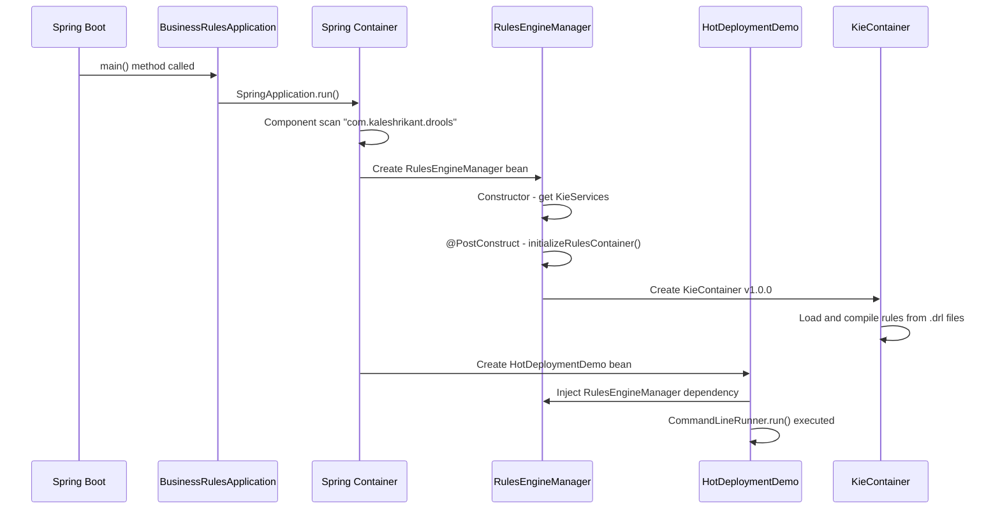
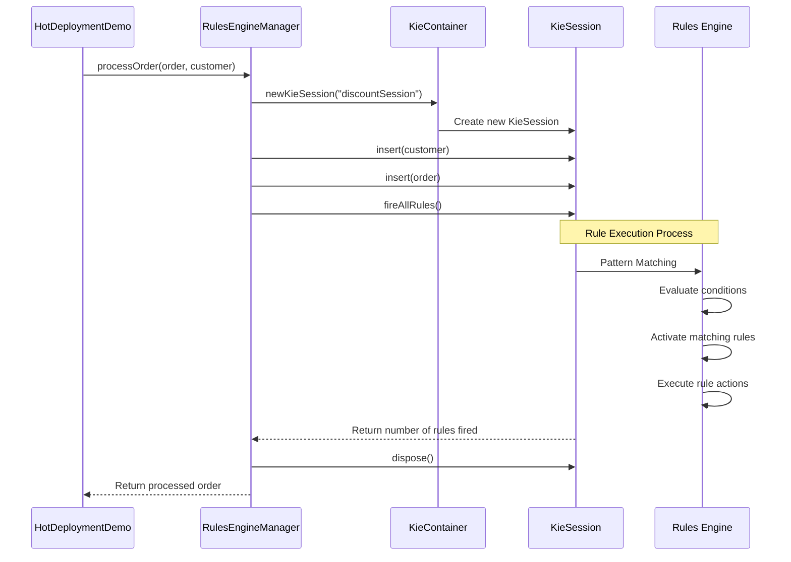
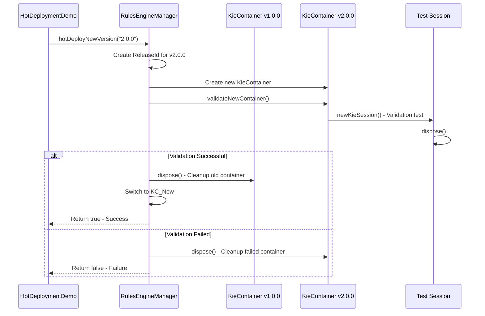
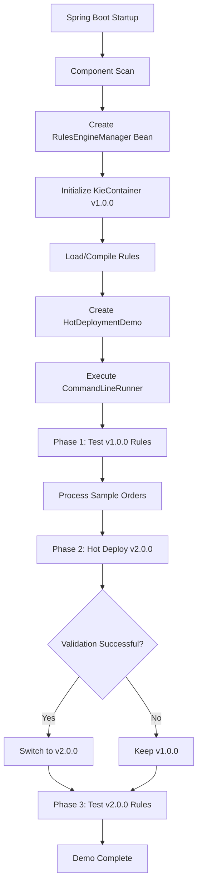
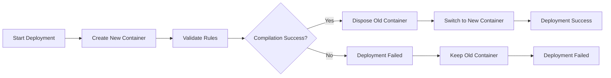
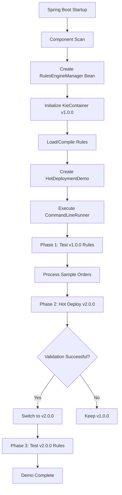

# Drools Hot Deployment - Complete Guide

## 📖 Table of Contents
1. [Architecture Overview](#architecture-overview)
2. [Project Structure](#project-structure)
3. [Step-by-Step Execution Flow](#step-by-step-execution-flow)
4. [Code Explanation](#code-explanation)
5. [Hot Deployment Mechanism](#hot-deployment-mechanism)
6. [Rule Execution Process](#rule-execution-process)
7. [Flow Diagrams](#flow-diagrams)
8. [Output Examples](#output-examples)

## 🏗️ Architecture Overview

### System Architecture
```
┌───────────────────────────────────────────────────────────┐
│ Spring Boot Application                                   │
│ ┌───────────────────────────────────────────────────────┐ │
│ │ HotDeploymentDemo                                     │ │
│ │ (CommandLineRunner - Triggers Demo)                   │ │
│ └───────────────┬───────────────────────────────────────┘ │
│                 │                                         │
│ ┌───────────────▼───────────────────────────────────────┐ │
│ │ RulesEngineManager                                    │ │
│ │ (@Component - Manages Rule Engine)                    │ │
│ └───────────────┬───────────────────────────────────────┘ │
│                 │                                         │
│ ┌───────────────▼───────────────────────────────────────┐ │
│ │ KieContainer                                          │ │
│ │ (Drools Rule Engine Container)                        │ │
│ └───────────────┬───────────────────────────────────────┘ │
│                 │                                         │
│ ┌───────────────▼───────────────────────────────────────┐ │
│ │ Business Rules                                        │ │
│ │ (.drl files - v1.0.0, v2.0.0)                         │ │
│ └───────────────┬───────────────────────────────────────┘ │
│                 │                                         │
│ ┌───────────────▼───────────────────────────────────────┐ │
│ │ Domain Models                                         │ │
│ │ (Customer, Order classes)                             │ │
│ └───────────────────────────────────────────────────────┘ │
└───────────────────────────────────────────────────────────┘
```

## 📁 Project Structure
```
drools-practice/
├── src/main/java/com/kaleshrikant/drools/
│   ├── BusinessRulesApplication.java # Spring Boot main class
│   ├── HotDeploymentDemo.java        # Demo runner
│   ├── RulesEngineManager.java       # Rule engine controller
│   └── model/
│       ├── Customer.java             # Customer domain class
│       └── Order.java                # Order domain class
├── src/main/resources/
│   ├── META-INF/kmodule.xml          # Drools configuration
│   └── rules/discount-rules.drl      # Business rules
└── pom.xml                           # Maven dependencies
```

## 🔄 Step-by-Step Execution Flow

### Application Startup Sequence



### Phase 1: Initial Rule Testing (v1.0.0)


### Phase 2: Hot Deployment Process


## 💻 Code Explanation

### 1. BusinessRulesApplication.java
```java
@SpringBootApplication
@ComponentScan(basePackages = "com.kaleshrikant.drools")
public class BusinessRulesApplication {
    public static void main(String[] args) {
        SpringApplication.run(BusinessRulesApplication.class, args);
    }
}
```

**Purpose:**
- Spring Boot entry point that starts the application context.
- Scans for components in the specified package.
- Autowires dependencies.

### 2. RulesEngineManager.java - Core Component
```java
@Component
public class RulesEngineManager {
    private KieContainer kieContainer;
    private String currentVersion = "1.0.0";
    
    @PostConstruct
    public void initialize() {
        initializeRulesContainer();
    }

    public Order processOrder(Order order, Customer customer) {
        KieSession session = kieContainer.newKieSession("discountSession");
        try {
            session.insert(customer);
            session.insert(order);
            int rulesFired = session.fireAllRules();
            return order;
        } finally {
            session.dispose();
        }
    }
}
```

**Key Methods:**
- Constructor: Gets Drools KieServices instance.
- `@PostConstruct`: Initializes rule container after bean creation.
- `processOrder()`: Executes rules for given order and customer.
- `hotDeployNewVersion()`: Performs hot deployment to new version.

### 3. HotDeploymentDemo.java - Demonstration Logic
```java
@Component
public class HotDeploymentDemo implements CommandLineRunner {
    private final RulesEngineManager rulesEngine;
    
    @Autowired
    public HotDeploymentDemo(RulesEngineManager rulesEngine) {
        this.rulesEngine = rulesEngine;
    }
    
    @Override
    public void run(String... args) {
        // Three-phase demonstration
        testVersion1();
        performHotDeployment();
        testVersion2();
    }
}
```

## 🔥 Hot Deployment Mechanism

**How Hot Deployment Works**

- **Initial State**:  
  `KieContainer v1.0.0 → Active Sessions → Processing Requests`

- **Deployment Process**:
    1. Create KieContainer v2.0.0 → Validate → Test Session
    2. If validation passes → Dispose old container → Switch to v2.0.0
    3. New requests use v2.0.0 rules immediately

- **Final State**:  
  `KieContainer v2.0.0 → New Sessions → Processing with New Rules`

**Key Features:**
- Zero Downtime
- Atomic Switch
- Validation & Rollback

## ⚡ Rule Execution Process

### Drools Rule Engine Internals
1. **Fact Insertion**
2. **Pattern Matching** (Working Memory, Agenda)
3. **Rule Execution** (Conflict resolution, Action execution)
4. **Session Cleanup**

### Example Rule Breakdown
```java
rule "Gold Customer Discount"
when
    $customer: Customer(level == "GOLD")
    $order: Order(amount > 1000)
then
    $order.addDiscount(0.15, "Gold Discount");
    System.out.println("Applied Gold discount");
end
```

**Execution Steps:**
- Insert facts into working memory.
- Pattern matching checks conditions.
- Activate matching rules → Added to agenda.
- Execute actions → Modify objects.

## 📊 Flow Diagrams

### Complete Application Flow


### Hot Deployment Decision Flow


## 🎯 Output Examples

### Expected Console Output
```
=== Starting Drools Hot Deployment Demo ===

=== Phase 1: Testing Initial Rules (v1.0.0) ===
--- New Customer - Small Order ---
Customer: Customer{name='Alice', level='NEW', loyaltyPoints=0, vip=false}
Initial Order: 200.0
v1.0.0: Applied 5% welcome discount for new customer
Fired 1 rules
Final Order: 190.0 (Discount: 5.0%)
Applied Discounts: [Welcome Discount]

=== Phase 2: Performing Hot Deployment ===
Attempting hot deployment to version: 2.0.0
✅ Hot deployment successful! Now using version: 2.0.0

=== Phase 3: Testing Enhanced Rules (v2.0.0) ===
--- New Customer - Small Order ---
Customer: Customer{name='Alice', level='NEW', loyaltyPoints=0, vip=false}
Initial Order: 200.0
v2.0.0: Applied 8% enhanced welcome discount for new customer
Fired 1 rules
Final Order: 184.0 (Discount: 8.0%)
Applied Discounts: [Enhanced Welcome Discount]
```

### Rule Version Comparison
| Aspect                  | Version 1.0.0 | Version 2.0.0 |
|--------------------------|---------------|---------------|
| New Customer Threshold   | Amount > 100  | Amount > 50   |
| New Customer Discount    | 5%            | 8%            |
| Silver Customer Threshold| Amount > 500  | Amount > 300  |
| Silver Customer Discount | 10%           | 12%           |
| Platinum Support         | ❌            | ✅ 25%         |
| VIP Treatment            | ❌            | ✅ 5% bonus    |

## 🚀 Key Benefits Demonstrated
- **Business Agility**: Rules can change without code deployment
- **Zero Downtime**: Updates happen without restarting application
- **Immediate Effect**: New rules apply to next request immediately
- **Safety Mechanisms**: Validation prevents broken rules deployment
- **Version Control**: Clear separation between rule versions
- **Monitoring**: Easy to track which rules are executing

---
✅ This implementation provides a production-ready hot deployment solution for business rules management using Drools and Spring Boot.


## 📊 Visual Diagrams

### 🚀 Execution Flow Diagram


### 🔄 Hot Deployment Decision Flow
